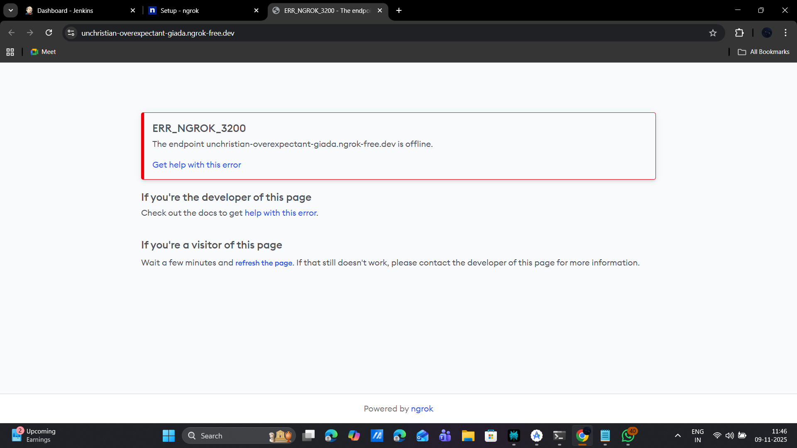

# ngrok Setup Guide - Expose Jenkins to Mobile Network

## 🎯 Why ngrok?

Since your phone is on mobile data and can't reach your local Jenkins at `192.168.1.9:8080`, ngrok
will:

- ✅ Create a public HTTPS URL that works from anywhere
- ✅ Provide automatic SSL certificate
- ✅ Work with your existing Jenkins installation
- ✅ Free tier available (perfect for development)

## 📦 Installation (Already Done!)

ngrok has been installed on your system.

## 🔧 Quick Setup Steps

### Step 1: Sign Up for ngrok (Free)

1. **Go to:** https://dashboard.ngrok.com/signup
2. **Sign up** with Google/GitHub or email (takes 30 seconds)
3. **Copy your authtoken** from: https://dashboard.ngrok.com/get-started/your-authtoken

### Step 2: Configure ngrok with Your Token

Open a **new PowerShell window** and run:

```powershell
ngrok config add-authtoken YOUR_TOKEN_HERE
```

Replace `YOUR_TOKEN_HERE` with the token from the ngrok dashboard.

### Step 3: Start the Tunnel

In the same PowerShell window, run:

```powershell
ngrok http 192.168.1.9:8080
```

You'll see output like this:

```
ngrok

Session Status                online
Account                       Your Account (Plan: Free)
Version                       3.3.1
Region                        United States (us)
Latency                       45ms
Web Interface                 http://127.0.0.1:4040
Forwarding                    https://abc123xyz.ngrok-free.app -> http://192.168.1.9:8080

Connections                   ttl     opn     rt1     rt5     p50     p90
                              0       0       0.00    0.00    0.00    0.00
```

### Step 4: Copy the HTTPS URL

Look for the line that says **"Forwarding"** - it will have a URL like:

```
https://abc123xyz.ngrok-free.app
```

**Copy this URL** - this is your public Jenkins URL!

### Step 5: Update Jenkins Account in App

1. **Open SecureOps app** on your phone
2. **Go to Settings** → **Accounts**
3. **Delete** the old Jenkins account (192.168.1.9:8080)
4. **Add new Jenkins account:**
    - Provider: **Jenkins**
    - Account Name: **Prakash D (ngrok)**
    - Base URL: **https://abc123xyz.ngrok-free.app** (paste the URL from Step 4)
    - API Token: **Your Jenkins token** (same as before)

5. **Save** and wait for sync

### Step 6: Test!

1. **Go to Dashboard** in the app
2. **Tap Refresh** icon
3. **Watch pipelines load!** 🎉

## 📱 Verify It Works

Before updating the app, test the ngrok URL:

1. **On your phone's browser** (using mobile data)
2. **Navigate to:** `https://abc123xyz.ngrok-free.app` (your ngrok URL)
3. **You should see** Jenkins login page
4. **If yes** → Update the app with this URL!

## ⚙️ Important Notes

### ngrok Free Tier Limitations:

- ✅ **1 online tunnel** at a time (perfect for us)
- ✅ **HTTPS included**
- ✅ **No time limit**
- ⚠️ **URL changes** each time you restart ngrok (see permanent URL below)
- ⚠️ **40 connections/minute** limit (fine for personal use)

### Get a Permanent URL (Optional - $8/month):

If you don't want the URL to change, upgrade to ngrok Pro and use:

```powershell
ngrok http 192.168.1.9:8080 --domain=your-domain.ngrok-free.app
```

## 🔒 Security Considerations

### Good News:

- ✅ ngrok provides HTTPS automatically
- ✅ Your Jenkins credentials are still required
- ✅ Connection is encrypted end-to-end

### Be Aware:

- ⚠️ Your Jenkins is now **publicly accessible** on the internet
- ⚠️ Make sure Jenkins authentication is enabled
- ⚠️ Use strong passwords
- ⚠️ Consider IP whitelisting in Jenkins security settings

### Recommended: Add ngrok Authentication

Add extra security layer to ngrok tunnel:

```powershell
ngrok http 192.168.1.9:8080 --basic-auth="username:password"
```

This adds HTTP Basic Auth BEFORE reaching Jenkins.

## 🎬 Complete Example

Here's the full workflow:

```powershell
# 1. Configure ngrok (one-time)
ngrok config add-authtoken 2abcDEF123xyz_YourActualTokenHere

# 2. Start tunnel (keep this running)
ngrok http 192.168.1.9:8080

# 3. Look for this in output:
# Forwarding   https://abc123xyz.ngrok-free.app -> http://192.168.1.9:8080

# 4. Use this URL in your app:
# https://abc123xyz.ngrok-free.app
```

## 🔄 Alternative: ngrok Configuration File

For convenience, create a config file:

**Create:** `C:\Users\aravi\.ngrok2\ngrok.yml`

```yaml
authtoken: YOUR_TOKEN_HERE
tunnels:
  jenkins:
    proto: http
    addr: 192.168.1.9:8080
    inspect: true
```

Then start with:

```powershell
ngrok start jenkins
```

## 🐛 Troubleshooting

### Error: "Account not found"

- You need to sign up and add authtoken
- Run: `ngrok config add-authtoken YOUR_TOKEN`

### Error: "Tunnel not found"

- Make sure Jenkins is running at 192.168.1.9:8080
- Test: Open browser to `http://192.168.1.9:8080`

### Error: "Failed to listen on port 4040"

- ngrok is already running
- Close previous instance or use different port: `ngrok http 192.168.1.9:8080 --port 4041`

### App still can't connect

- Make sure you're using HTTPS URL from ngrok (not HTTP)
- Remove the trailing slash from URL if present
- Check Jenkins authentication is correct

## 🎯 Next Steps

1. **Sign up** at https://dashboard.ngrok.com/signup
2. **Get authtoken** from https://dashboard.ngrok.com/get-started/your-authtoken
3. **Run these commands:**
   ```powershell
   ngrok config add-authtoken YOUR_TOKEN
   ngrok http 192.168.1.9:8080
   ```
4. **Copy the HTTPS URL** from ngrok output
5. **Update Jenkins account** in the app with new URL
6. **Test!**

## 💡 Pro Tips

### Keep ngrok Running

- Don't close the PowerShell window
- ngrok must stay running for the tunnel to work
- Consider running as a Windows service for always-on access

### Monitor Requests

- Open http://localhost:4040 in browser
- See all HTTP requests going through ngrok
- Great for debugging

### Share Access

- The ngrok URL can be shared with team members
- Everyone can access your Jenkins (if you want)
- Remember: it's publicly accessible!

---

## 🆚 ngrok vs Cloud Jenkins Comparison

| Feature | ngrok (Local + Tunnel) | Cloud Jenkins |
|---------|----------------------|---------------|
| **Setup Time** | 5 minutes | 30-60 minutes |
| **Cost** | Free (or $8/mo for permanent URL) | $10-50/mo |
| **Performance** | Fast (local execution) | Depends on cloud provider |
| **Maintenance** | You manage Jenkins | Provider manages |
| **Data Privacy** | Your server | Cloud provider |
| **Internet Required** | Only for phone access | Always |
| **Jenkins Plugins** | All available | All available |
| **Best For** | Development, Testing | Production, Teams |

**Recommendation for you:** Start with **ngrok** since you already have Jenkins running locally.
It's the fastest path to get your app working!

---

## ✅ Success Criteria

You'll know it's working when:

1. ✅ Phone browser can open ngrok URL and see Jenkins
2. ✅ App shows pipelines after refresh
3. ✅ Logs show: "Synced X pipelines for account: Prakash D"

Ready to get started? Let's do this! 🚀
